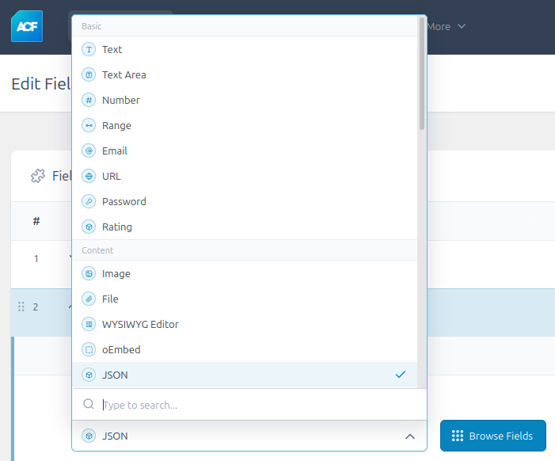
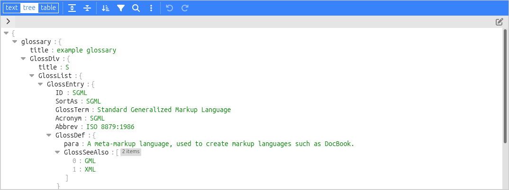

# ACF JSON Field

ACF JSON Field is a Wordpress plugin adding a new ACF field to edit, save and output JSON data.

## Installation

- Download the [latest version on GitHub](https://github.com/misaki-web/acf-json-field/releases/latest/download/acf-json-field.zip).

- Extract the archive and copy the folder (`acf-json-field`) to the Wordpress plugins folder (`/wp-content/plugins/`).

- Go to the Wordpress plugins manager on your website (`https://.../wp-admin/plugins.php`) and enable the plugin **ACF JSON Field**. Note that you can enable auto-updates.

## Usage

Go to the ACF administration page (`https://.../wp-admin/edit.php?post_type=acf-field-group`), add a new field group and choose the field **JSON**. Change the field settings as needed.



When editing a page containing a JSON field, an editor will allow the user to edit the JSON data:



### Utilities and shortcode

The plugin provides utility methods to retrieve, format, and set JSON data from a specified ACF field, as well as a shortcode to display this data on the front end.

The `get_json_field` method can be called as follows:

```php
use \AcfJsonField\JsonUtils;

// Retrieve the JSON data as a PHP type (array, boolean, etc.) for the current post
$json_data = JsonUtils::get_json_field('field_name_or_key');
$json_data = JsonUtils::get_json_field('field_name_or_key', false);
$json_data = JsonUtils::get_json_field('field_name_or_key', null);

// For a specific post ID
$json_data = JsonUtils::get_json_field('field_name_or_key', 125);

// For the current user
$json_data = JsonUtils::get_json_field('field_name_or_key', 'user');

// For a specific user
$json_data = JsonUtils::get_json_field('field_name_or_key', 'user_24');

// Retrieve the JSON data as an HTML formatted string
$json_html = JsonUtils::get_json_field('field_name_or_key', $id, 'html');
```

Or as follows:

```php
$json_data = \AcfJsonField\JsonUtils::get_json_field('field_name_or_key');
```

To set the JSON data for a specific ACF field, use the `set_json_field` method:

```php
$php_data = ['lorem1' => 'ipsum2', 'lorem2' => 'ipsum2'];
$success = JsonUtils::set_json_field('field_name_or_key', $php_data, 125);

$json_encoded = json_encode($php_data);
$success = JsonUtils::set_json_field('field_name_or_key', $json_encoded, 125, true);
```

To encode PHP data to a JSON string with pretty print formatting, use the `encode` method:

```php
$json_encoded = JsonUtils::encode($php_data);
```

To display the field value on the front end, the shortcode `acf_json_field` can be used. By default, it'll look at the current post where the shortcode is added:

	[acf_json_field field="field_name_or_key"]

To get the field value from another post, specify the `id`:

	[acf_json_field field="field_name_or_key" id="125"]

If the JSON field is linked to the current user, set the `id` to `user`:

	[acf_json_field field="field_name_or_key" id="user"]

To get the field value from another user, specify the user `id`:

	[acf_json_field field="field_name_or_key" id="user_24"]

## License

ACF JSON Field: A Wordpress plugin adding a new ACF field to edit, save and output JSON data  
Copyright (C) 2024  Misaki F.

This program is free software: you can redistribute it and/or modify
it under the terms of the GNU General Public License as published by
the Free Software Foundation, either version 3 of the License, or
(at your option) any later version.

This program is distributed in the hope that it will be useful,
but WITHOUT ANY WARRANTY; without even the implied warranty of
MERCHANTABILITY or FITNESS FOR A PARTICULAR PURPOSE.  See the
GNU General Public License for more details.

You should have received a copy of the GNU General Public License
along with this program.  If not, see <https://www.gnu.org/licenses/>.

### Third-party code

- ACF JSON Field uses [Plugin Update Checker](https://github.com/YahnisElsts/plugin-update-checker) under the [MIT License](https://github.com/YahnisElsts/plugin-update-checker/blob/master/license.txt) in order to manage auto-updates in the Wordpress plugins manager.
